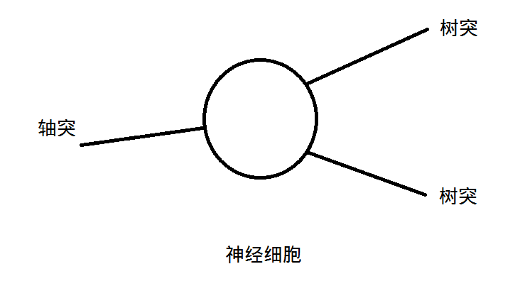
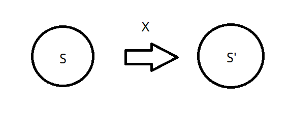

# 记录

## 神经细胞

生物神经细胞拥有多个树突，用来接受来自其它神经细胞的信号，拥有一个轴突用来发送自己产生的信号给其它神经细胞。许多神经细胞彼此连接，构成神经网络。

神经细胞的特点：

- 有兴奋和抑制两种状态
- 根据树突接收的信号和某些未知的内部情况决定应该兴奋还是抑制
- 一个神经细胞通过树突可以连接多个神经细胞的轴突

## 表示

用`1`和`0`分别表示兴奋和抑制两种状态，按顺序排列一个神经细胞的树突。假如一个神经细胞有两个树突，那么它接收到的可能输入情况总共有：

    {(0,0), (0,1), (1,0), (1,1)}

这个神经细胞会根据输入的情况在内部进行某种变换后输出`1`或者`0`。

假如把神经细胞看做一个状态机，内部状态表示为`S`，把任意一种输入情况表示为`X`，输出结果表示为`y`，那么神经细胞的一次变换就是根据`S`，`X`通过状态迁移得到下一个状态`S'`的过程。由于`y`也属于细胞状态，所以从`S'`能推出对应的`y`的情况。

