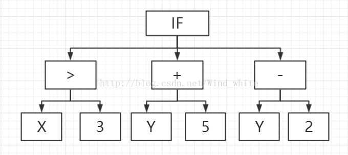

# 遗传编程

在以往遇到问题的时候，我们都会选择一种适合于解决该问题的算法，对于特定的问题还需要对参数进行调整，或者借助前文讲述的优化手段来找出一个满意的参数集来。计算机的工作就是将算法进行运行后输出结果，我们希望能够找到一种能够自动构造出解决某一问题的最佳程序的方法，通用地用于解决各种问题。即，构造出一个能够构造算法的算法。

## 遗传编程的基础框架

为了自动构造一个程序，我们首先要了解算法在计算机中的存储方式，从而设计和构造和运行一个程序。

学过《编译原理》课程的同学们都知道，我们经过“词法分析”、“语法分析”、“语义分析”以后构造出了中间代码，而中间代码的形式是多种多样的，如三元式、四元式、语义树等，根据中间代码我们就可以在对应平台上生成目标机器代码了。可想而知，我们既然要自动化构造算法，那么直接构造出中间代码形式的算法就可以运行了，而不用写成自然语言形式的代码来方便我们理解，而且中间代码也是具有可读性的，所以生成中间代码的形式是我们首先需要确定下来的。

大多数编程语言，都会生成一颗解析树，所以我们也不妨采用树的形式来构建程序。

